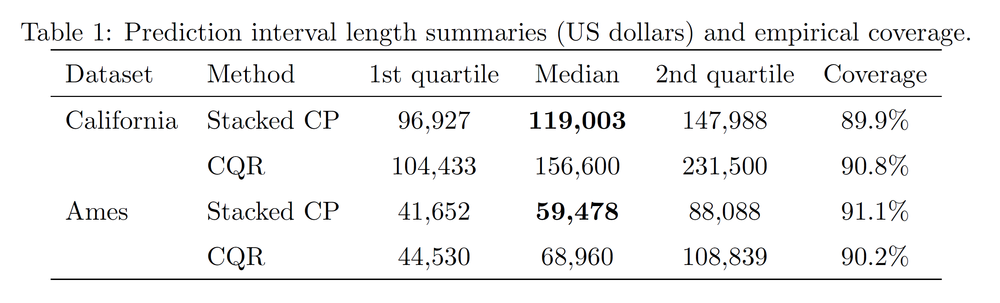
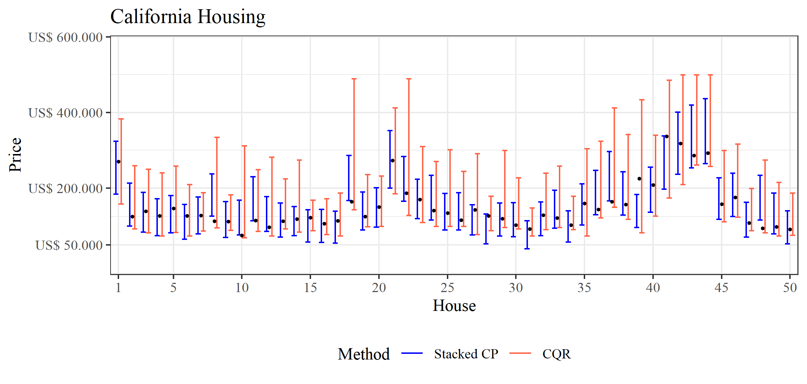
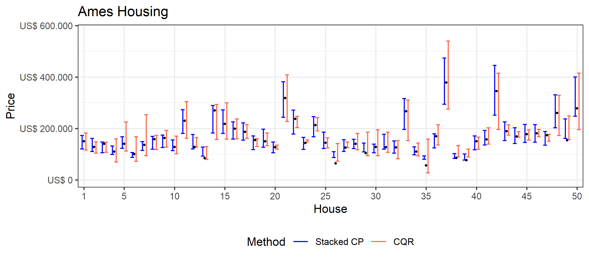

# stacked_cp

# Stacked conformal prediction

> Paulo C. Marques F.

[Paper](https://raw.githubusercontent.com/mlresearch/v266/main/assets/marques25a/marques25a.pdf)

### Abstract

We consider the conformalization of a stacked ensemble of predictive models, showing that the potentially simple form of the meta-learner at the top of the stack enables a procedure with manageable computational cost that achieves approximate marginal validity without requiring the use of a separate calibration sample. Empirical results indicate that the method compares favorably to a standard inductive alternative.

